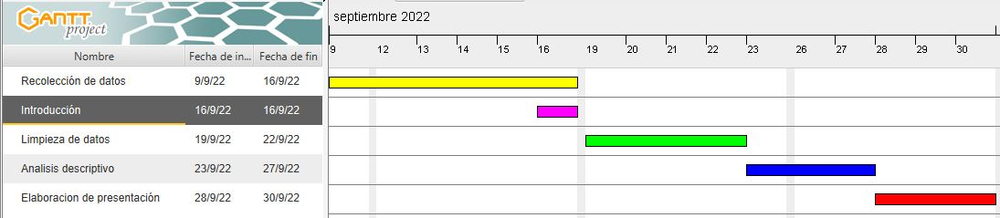

```{r setup, include=FALSE}
knitr::opts_chunk$set(echo = FALSE)
library(readr)
library(dplyr)
library(tidyverse)
library(stats4)
library(MASS)
library(survival)
library(distrMod)
library(fitdistrplus)

DF <- read_csv("limpio_2.csv")

```

# Introducción

+ **Relevancia**

Nuestro estudio es relevante porque permite encontrar si la relación entre la preferencia en videojuegos de los alumnos y su perfil estudiantil. Con esta información podremos validar o rechazar algunas ideas o prejuicios alrededor de los videojuegos; por ejemplo, la idea de que jugar videojuegos lleva a un menor rendimiento.

+ **Objetivo del estudio**

Nuestro estudio busca recolectar datos del perfil universitario de los estudiantes y relacionarlo al uso de videojuegos. Nos enfocamos principalmente en la relación entre los videojuegos y el perfil académico, aunque consideramos otros factores.

+ **Planificación**
  



# Analisis Probabilistico

## Costo

La densidad del costo se ve asi:
```{r}
hist(DF$Costo,
     main="Histograma de Precios de Compra Incluyendo Ceros",
     ylab = "Densidad",
     xlab = "Costo del ultimo videojuego comprado",
     #breaks = 30,
     prob = T
     )
```

# 
Si eliminamos los ceros de nuestros datos eso nos deja con una distribucion que se ve asi:
```{r}
Costo_No_ceros = DF$Costo[DF$Costo != 0 & DF$Costo < 400 & !is.na(DF$Costo)]
hist(Costo_No_ceros,
  main="Histograma de Precios de Compra",
  ylab = "Densidad",
  xlab = "Precios de Compra",
  freq = TRUE,
  breaks = seq(0,300,by=10),
  xlim = c(0,300),
  #ylim = c(0,30)
)
abline(v=c(50,200),
       col="red",
       lwd=3
       )
text(x=c(0,110,215),y=c(20),c("Indie","AA", "AAA"))
```

# 
$$ \mathbb{C}_{total} = \mathbb{C_i} \cup \mathbb{C}_{AA} \cup \mathbb{C}_{AAA} $$

```{r}
Costos_Indie = Costo_No_ceros[Costo_No_ceros <= 50]
Costos_AA = Costo_No_ceros[Costo_No_ceros > 50 & Costo_No_ceros <= 200]
Costos_AAA = Costo_No_ceros[Costo_No_ceros > 200]
```

Solo separando las observaciones ya podemos recolectar algunos datos interesantes. Si lo que estamos asumiendo respecto a las categorias es cierto, entonces el `r round((length(Costos_Indie)/length(DF$Costo[!is.na(DF$Costo)]))*100,2)`% de las observaciones son indie, el `r round((length(Costos_AA)/length(DF$Costo[!is.na(DF$Costo)]))*100,2)`% son AA y solo el `r round((length(Costos_AAA)/length(DF$Costo[!is.na(DF$Costo)]))*100,2)`% son AAA. Vale la pena recordar que hay un `r round(100*(sum(DF$Costo == 0, na.rm = TRUE)/sum(!is.na(DF$Costo))),2)`% de probabilidad de que sea cero.

```{r}
par(mfrow=c(1,3))
hist(Costos_Indie,
     breaks=5,
     main = "Indie"
     )
max(Costos_AA)
min(Costos_AA)
hist(Costos_AA,
     breaks=seq(50, 200, 30),
     main = "AA"
     )
hist(Costos_AAA,
     breaks=5,
     main = "AAA"
     )
```
Los datos que corresponden a los videojuegos Indie no se comportan de forma normal dado que al normalizarlos no tienen las proporciones adecuadas, ni de forma poisson por la relacion que hay entre la media y la desviacion estandar ($sd(\mathbb{X} ) \simeq media(\mathbb{X})$ ). Tampoco son exponenciales dado que la forma no es la apropiada y la media y desviacion estandar no cuadran. Sin embargo, dado que el rango es desde `r min(Costos_Indie)` hasta `r max(Costos_Indie)` la media esperada para una Uniforme seria de `r round((max(Costos_Indie)+min(Costos_Indie))/2,2)` y la desviacion estandar esperada seria de `r round(sqrt(((max(Costos_Indie)-min(Costos_Indie))^2)/12),2)`. Ambos descriptores se parecen a los observados (sd = `r round(sd(Costos_Indie),2)`, media = `r round(mean(Costos_Indie),2)`) asi que la variable que mas se asemeja dentro de las estudiadas es la Uniforme, a pesar del sesgo a la izquierda que presenta. Lo mismo se cumple para los costos de AA y AAA.Esto significa que nuestro modelo quedaria asi:

# 
Existe T tal que
```{r}
min(Costos_AA)
max(Costos_AA)
```
$$ 
 \mathbb{T} =      \begin{cases}
     \text{Gratis} \quad \text{con probabilidad } 0.29 \\
     \text{Indie} \quad \text{con probabilidad } 0.42 \\
     \text{AA} \quad \text{con probabilidad } 0.26 \\
     \text{AAA} \quad \text{con probabilidad } 0.02 \\
     \end{cases} \\
$$
Y existe X tal que:
$$
     \\
\mathbb{X} \sim 
     \begin{cases}
     \mathbf{0}, \qquad \qquad \qquad \qquad \mathbb{T} = \text{Gratis} \\
     \mathbf{Unif(4,100)}, \qquad \quad \mathbb{T} = \text{Indie} \\
     \mathbf{Unif(55,200)}, \qquad \mathbb{T} = \text{AA} \\
     \mathbf{Unif(229,280)}, \qquad \mathbb{T} = \text{AAA} \\
     \end{cases} 
$$
Creemos que esto se debe a que los Utecsinos eligen videojuegos baratos exponencialmente mas que videojuegos caros, y que una ves han decidido en que categoria quieren tener un videojuego el precio no es un factor tan importante. Esto explica por que la variable _holistica_ se ajusta a un modelo exponencial.

# Genero de juego

Densidad de los generos se ven asi:

```{r}
DF$Cuantos_Generos = DF$Arcade + DF$Aventura + DF$Deportes_y_carreras + DF$Estrategia + DF$Casual + DF$RPG + DF$MOBA + DF$Shooter + DF$Simulacion + DF$Peleas + DF$Plataformas + DF$Sandbox
hist(DF$Cuantos_Generos,
     main="Histograma de cuantos generos prefieren",
     ylab = "Densidad",
     xlab = "Número de generos que gustan",
     prob = T
     )

```

Consideremos que queremos elegir 20 estudiantes al azar, considerando que en UTEC las aulas hay salones de 20 estudiantes. Planteamos como caso de éxito el hecho de que los estudiantes elegidos les guste menor o igual de 3 géneros de juego, ya que de acuerdo a nuestra muestra, les gusta pocos géneros de juego por lo general.
La probabilidad de que les guste menos o igual a 3 géneros de juego, para nuestro caso sería de 85/202, equivalente a 0.42 aproximadamente. Entonces el Modelo Binomial se vería de la siguiente manera:

X -> número de estudiantes que les gusta 3 a menos géneros de juegos en una aula de 20 alumnos

X∼Bin(202,0.42)

n -> número de muestras (20 encuestados)

p -> probabilidad de que la persona seleccionada le guste 3 a menos géneros de juegos es (85/202)

Ejemplo: La probabilidad de que 5 alumnos (cantidad de personas en un grupo de trabajo por lo general en los cursos) en un aula le guste 3 a menos géneros de juegos.
Tomamos en cuenta este análisis saber que probable sería tener un grupo en un curso y saber a todos los integrantes del grupo si les gusta por lo general la misma cantidad de géneros de juegos, usamos una distribución negativa binomial.

# 

```{r}
r <- 5
p <- 0.42
n <- 20 - r
pDB <- dnbinom(x = n, size = r, prob = p)
data.frame(x = 0:17, prob = dnbinom(x = 0:17, size = r, prob = p)) %>%
  mutate(Failures = ifelse(x == n, n, "otro")) %>%
ggplot(aes(x = factor(x), y = prob, fill = Failures)) +
  geom_col() +
  geom_text(
    aes(label = round(prob,3), y = prob + 0.01),
    position = position_dodge(0.5),
    size = 2.5,
    vjust = 1
  ) +
  labs(title = "Probabilidad cuando r es 5, Exito cuando x es 20 Intentos", 
       x = "Intentos fallidos cuando: (x - r)",
       y = "Probabilidad de exito")
``` 

De la gráfica obtenemos que lo más probable es que se presenten 5 intentos fallidos con un porcentaje de 10,8%, es un número de intentos fallidos mediano ya que un 42% de alumnos les gusta pocos géneros de juego.

# Creditos

```{r}
knitr::opts_chunk$set(echo = FALSE)
library(stats4)
library(MASS)
library(survival)
library(distrMod)
```

```{r}
library(distrMod)
vector = DF$Creditos[!DF$Creditos ==0]
creditos = na.omit(vector)
pois.f<- fitdist(c(creditos), "pois")# Poisson
summary(pois.f)
credito_maximo = max(DF$Creditos,na.rm=TRUE)
x1 <- 1:credito_maximo
lambda_poisson <- 18.61692
plot(dpois(x1, lambda_poisson), type = "h", lwd = 2,
     main = "Probabilidad Poisson",
     ylab = "P(X = x)", xlab = "Creditos Academicos")
```

# 
```{r}
hist(creditos,prob=TRUE,main="Histograma de variable Creditos",ylab="Densidad",xlab="Creditos")
lines(density(creditos), col = 4, lwd = 2)

#Probabilidad de que una persona lleve mas de 16 creditos academicos 
cpp = ppois(16, lambda = lambda_poisson, lower.tail = FALSE)
round(cpp,2)

```
Obtenemos como resultado que la probabilidad de que un estudiante lleve más de 16 creditos academicos es del 68%

```{r}
vector3 = DF$Gasto[!DF$Gasto ==0]
maximo_gasto = max(DF$Gasto)
gastar = na.omit(vector3)
exp.f<- fitdist(c(gastar), "exp")# Exponencial
summary(exp.f)
lambda_expo <- 0.003150127
xx <- 1:maximo_gasto
```
# 
```{r}
plot(dexp(xx, lambda_expo), type = "h", lwd = 1,
     main = "Probabilidad exponencial",
     ylab = "P(X = x)", xlab = "Dinero Gastado")

```

# 
```{r}
hist(gastar,prob=TRUE,main="Histograma de variable Gasto",ylab="Densidad",xlab="Dinero Gastado")
curve(dexp(x, rate = 0.003150127), col = 2, lty = 2, lwd = 2, add = TRUE)
```

```{r}
#Probabilidad de que una persona gaste igual o menos que 500 soles
messi <- pexp(500,rate = lambda_expo,lower.tail = TRUE)
round(messi,2)

```
Obtenemos como resultado que la probabilidad de que un estudiante gaste igual o menos que 500 soles es del 79%

# Promedio
```{r}
hist(DF$Promedio)
```

Para analizar el comportamiento de los promedios declarados por los alumnos entrevistados se ha elaborado el histograma de probabilidad de esta variable, que ha permitido validar no solo el gran porcentaje de notas aprobatorias de estos alumnos, sino que las mismas se concentran en su mayoria en promedio 14  
# 
```{r}
hist(DF$Promedio,probability = 1, main = "Probabilidad del promedio", ylab = "Probabilidad",breaks = 20)
```

Para poder obtener ver los valores explícita mente de las probabilidades se evidencia en la siguiente tabla.

```{r}
probPromedio <- prop.table(table(DF$Promedio))
probPromedio <- data.frame(probPromedio)
names(probPromedio)[names(probPromedio)=='Freq'] <- 'Probabilidad'
probPromedio
```


Se calcula la media:
```{r}
mu_Pro<-mean(DF$Promedio,na.rm=T)
mu_Pro
```

La media es: 14.3997

Calculamos la desviación estándar:
```{r}
sd_Pro<-sd(DF$Promedio,na.rm=T)
sd_Pro
```
# 
El valor de la desviación estándar es: 2.76536
Con los datos obtenidos se va graficar la función normal en el histograma

```{r}
hist(DF$Promedio,probability = 1,main = "Histograma del Promedio",xlab = "Promedio", breaks = 20)
curve(dnorm(x,mu_Pro,sd_Pro),lwd=2,add=T)
```

En la gráfica se puede apreciar que las notas se encuentran en el rango de 9 a 20.

En este caso nos planteamos la siguiente pregunta ¿Cual es la probabilidad de que los estudiantes tengan un promedio aprobatorio (10.5)?
La función probabilidad sería P(10.5<=X<=20) el cálculo seria P(X<20) - P(X<10.5)

```{r}
pnorm(20,mu_Pro,sd_Pro)-pnorm(10.5,mu_Pro,sd_Pro)
```

La probabilidad de que los alumnos encuestados tengan un promedio aprobatorio jugando videojuegos es de 0.8993336


